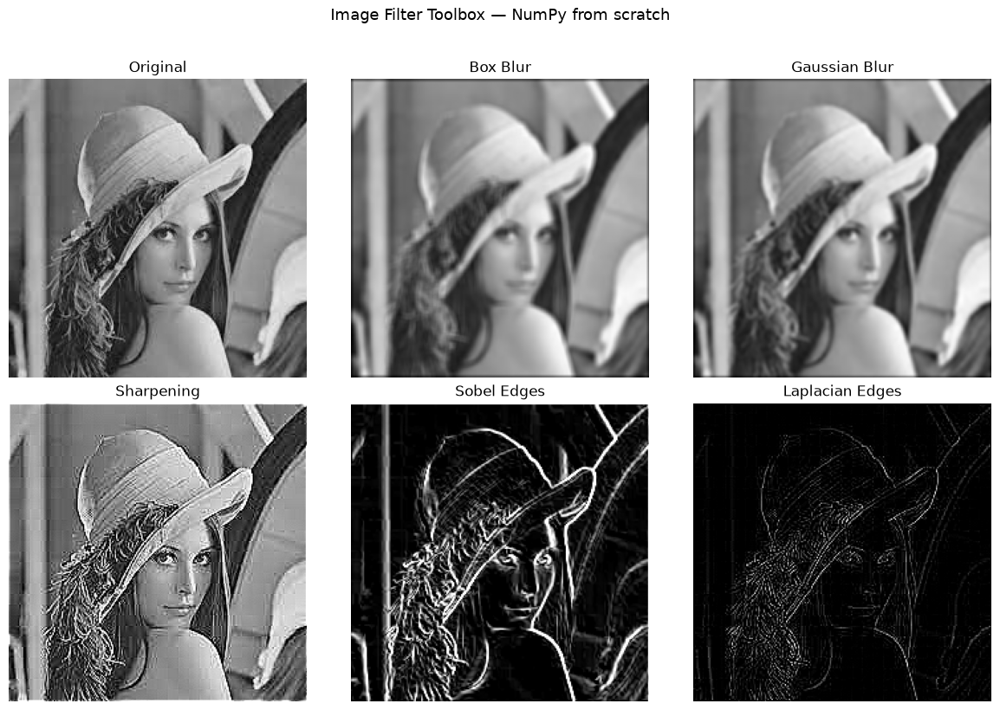

# Image Filter Toolbox

Built from scratch using only NumPy.

## What it does
Implements 5 image filters manually using 2D convolution — no OpenCV filter functions used.

## Filters implemented
- Box blur — uniform average of neighbouring pixels
- Gaussian blur — weighted average using bell curve kernel
- Sharpening — amplifies centre pixel, subtracts neighbours
- Sobel edge detection — detects horizontal and vertical edges separately, combines with gradient magnitude
- Laplacian edge detection — second-order edge detection in all directions

## Key concepts
- 2D convolution implemented from scratch using nested loops
- Zero-padding to preserve output image size
- Kernel normalization for blur filters (sum = 1)
- Edge kernels intentionally sum to 0 to cancel flat regions

## Output

## How to run
pip install numpy matplotlib
python filters.py
